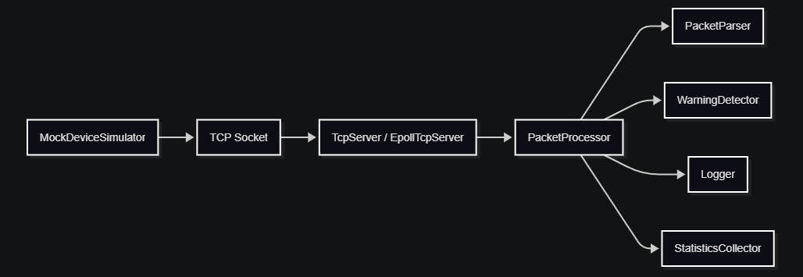
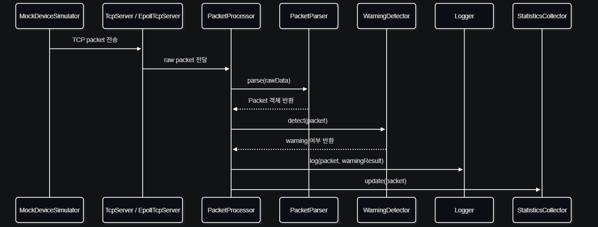
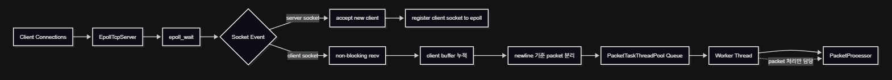

# C++ Linux TCP 장비 데이터 수신 서버

## 1. 프로젝트 개요
이 프로젝트는 가상의 장비가 TCP 서버로 전송하는 packet을 C++ Linux 서버가 수신하고, 수신된 데이터를 Parsing, 이상값 감지, 로그 저장, 통계 수집까지 처리하는 장비 데이터 수신 서버입니다.

- 진행 기간 : 2026.06.04 ~ 2026.06.22
- 목표 : Linux 환경에서 C++ 기반 TCP 서버를 직접 구현하면서, 서버 구조에 따른 처리 방식의 차이를 학습하고 검증하는 것

## 2. 개발 환경
- C++17
- WSL Ubuntu
- Linux TCP Socket
- Port : 9000
- Log 저장 : logs/device.log

## 3. Packet Format
Mock 장비는 TCP 서버로 다음 형식의 packet을 전송합니다.

```
deviceId|timestamp|type|value
```

예시:

```
SAT-001|2026-06-22T19:30:10|TEMP|83.5
SAT-001|2026-06-22T21:04:43|SIGNAL|42.1
```

한 번의 connection에서 여러 packet이 연속으로 전송될 수 있기 때문에, 각 packet은 `\n`을 기준으로 구분하고 있습니다.

## 4. 전체 처리 흐름도


<details>
<summary> 컴포넌트별 역할 </summary>

| 컴포넌트 | 역할 |
| --- | --- |
| MockDeviceSimulator | mock packet 생성 및 서버 전송 |
| PacketProcessor | 수신 packet 처리 흐름 연결 |
| PacketParser | raw string을 Packet 객체로 변환 |
| WarningDetector | 이상값 판단 |
| Logger | 파일 로그 저장 |
| StatisticsCollector | type별 통계 수집 |
</details>

<details>
<summary> Packet 처리 시퀀스 다이어그램 </summary>


</details>

## 5. 서버별 구조 및 동작 방식
이 프로젝트에서는 동일한 packet 처리 흐름을 사용하되, client socket을 처리하는 서버 구조를 두 가지 방식으로 구현했습니다.

* ThreadPool TCP Server
* Epoll TCP Server

두 서버 모두 수신한 packet을 최종적으로 `PacketProcessor`에 전달하지만, client connection과 socket event를 처리하는 방식에서 차이가 있습니다.

---

### 5-1. ThreadPool TCP Server
ThreadPool TCP Server는 client connection 단위로 작업을 처리하는 구조입니다.


#### 동작 흐름
```txt
TcpServer
→ ThreadPool
→ ClientSession
→ PacketProcessor
```

1. `TcpServer`가 client connection을 `accept()`합니다.
2. accept된 client socket을 ThreadPool queue에 추가합니다.
3. worker thread가 queue에서 client socket 작업을 꺼냅니다.
4. worker thread는 `ClientSession`을 실행합니다.
5. `ClientSession`은 해당 client socket의 `recv()` loop를 담당합니다.
6. `\n` 기준으로 완성된 packet을 분리한 뒤 `PacketProcessor`로 전달합니다.

---

### 5-2. Epoll TCP Server
Epoll TCP Server는 `epoll`을 사용하여 여러 client socket event를 감지하고, 완성된 packet 처리만 worker thread에 위임하는 구조입니다.




#### 동작 흐름
```txt
EpollTcpServer
→ epoll event loop
→ PacketTaskThreadPool
→ PacketProcessor
```

1. `EpollTcpServer`가 server socket과 client socket을 epoll에 등록합니다.
2. `epoll_wait()`를 통해 socket event를 감지합니다.
3. client socket은 non-blocking `recv()`로 읽습니다.
4. 수신 데이터는 client별 buffer에 누적합니다.
5. `\n` 기준으로 완성된 packet만 분리합니다.
6. 완성된 packet을 `PacketTaskThreadPool`에 추가합니다.
7. worker thread는 packet 처리 작업만 수행하고, `PacketProcessor`로 전달합니다.

---

### 5-3. 두 서버 구조 비교

| 구분        | ThreadPool TCP Server         | Epoll TCP Server          |
| --------- | ----------------------------- | ------------------------- |
| 처리 기준     | client connection 단위          | socket event / packet 단위  |
| worker 역할 | `ClientSession`의 recv loop 담당 | 완성된 packet 처리 담당          |
| socket 처리 | blocking recv 기반              | non-blocking recv 기반      |
| 구조 특징     | 구현 흐름이 직관적                    | event 감지와 packet 처리 분리    |
| 장점        | 안정적인 connection 단위 처리         | 다중 socket event 처리에 적합    |
| 주의점       | worker가 connection에 묶일 수 있음   | packet 누락 방지를 위한 세부 처리 필요 |

## 6. 빌드 및 실행 방법
현재 프로젝트는 WSL Ubuntu 환경에서 `g++`를 사용하여 직접 컴파일합니다.

### 6-1. ThreadPool TCP Server 빌드
```bash
g++ -std=c++17 -Wall -Wextra -pthread \
src/app/server_main.cpp \
src/server/TcpServer.cpp \
src/server/ThreadPool.cpp \
src/server/ClientSession.cpp \
src/processor/PacketProcessor.cpp \
src/domain/Packet.cpp \
src/parser/PacketParser.cpp \
src/detector/WarningDetector.cpp \
src/logger/Logger.cpp \
src/statistics/StatisticsCollector.cpp \
src/statistics/StatisticsReporter.cpp \
-o threadpool_server
```

실행:
```bash
./threadpool_server
```

---

### 6-2. Epoll TCP Server 빌드
```bash
g++ -std=c++17 -Wall -Wextra -pthread \
src/app/epoll_server_main.cpp \
src/server/EpollTcpServer.cpp \
src/server/PacketTaskThreadPool.cpp \
src/processor/PacketProcessor.cpp \
src/domain/Packet.cpp \
src/parser/PacketParser.cpp \
src/detector/WarningDetector.cpp \
src/logger/Logger.cpp \
src/statistics/StatisticsCollector.cpp \
src/statistics/StatisticsReporter.cpp \
-o epoll_server
```

실행:
```bash
./epoll_server
```

---

### 6-3. MockDeviceSimulator 빌드
```bash
g++ -std=c++17 -Wall -Wextra -pthread \
src/app/mock_simulator_main.cpp \
src/mock/MockDeviceSimulator.cpp \
-o mock_simulator
```

실행:
```bash
./mock_simulator <clientCount> <packetCount> <delayMs>
```

실행 인자의 의미는 다음과 같습니다.

| 인자            | 설명                      |
| ------------- | ----------------------- |
| `clientCount` | 동시에 실행할 client 수   |
| `packetCount` | client 1개가 전송할 packet 수 |
| `delayMs`     | packet 전송 간격(ms)        |

실행 예시:
```bash
./mock_simulator 1 30 100
./mock_simulator 5 30 50
./mock_simulator 10 30 10
./mock_simulator 20 100 100
./mock_simulator 100 1000 0
```

---

### 6-4. 실행 순서

먼저 서버를 실행합니다.

```bash
./threadpool_server
```

또는

```bash
./epoll_server
```

이후 다른 터미널에서 mock simulator를 실행하여 packet을 전송합니다.

```bash
./mock_simulator 5 30 50
```

서버는 `9000`번 포트에서 client connection을 수신하고, 처리 결과는 `logs/device.log`에 저장됩니다.

## 7. (테스트) ThreadPool TCP Server vs Epoll TCP Server
ThreadPool TCP Server와 Epoll TCP Server를 동일한 mock traffic 조건에서 실행하여 처리 결과를 비교했습니다.

테스트의 목적은 단순히 어느 서버가 더 빠른지를 판단하는 것이 아니라, 동일 조건에서 두 서버가 정상 처리되는지 확인하고 서버 구조 차이로 인한 처리 경향을 관찰하는 것이었습니다.

자세한 테스트 정리글은 아래 링크하였습니다.
- https://jijbab-bodmbodm-1356.tistory.com/159

---

### 7-1. 일반 Traffic 비교 테스트

#### 테스트 조건

| 테스트 | clientCount | packetCount per client | delayMs | Expected Total |
| --- | ----------: | ---------------------: | ------: | -------------: |
| A   |           1 |                     30 |     100 |             30 |
| B   |           5 |                     30 |      50 |            150 |
| C   |          10 |                     30 |      10 |            300 |
| D   |          20 |                    100 |     100 |           2000 |

#### 테스트 결과

| 테스트 | 서버                    | Expected Total | Total packets | Parse errors | Processing elapsed(ms) | 결과    |
| --- | --------------------- | -------------: | ------------: | -----------: | ---------------------: | ----- |
| A   | ThreadPool TCP Server |             30 |            30 |            0 |                   2904 | 정상 처리 |
| A   | Epoll TCP Server      |             30 |            30 |            0 |                   2904 | 정상 처리 |
| B   | ThreadPool TCP Server |            150 |           150 |            0 |                   1506 | 정상 처리 |
| B   | Epoll TCP Server      |            150 |           150 |            0 |                   1454 | 정상 처리 |
| C   | ThreadPool TCP Server |            300 |           300 |            0 |                    312 | 정상 처리 |
| C   | Epoll TCP Server      |            300 |           300 |            0 |                    294 | 정상 처리 |
| D   | ThreadPool TCP Server |           2000 |          2000 |            0 |                  10082 | 정상 처리 |
| D   | Epoll TCP Server      |           2000 |          2000 |            0 |                   9917 | 정상 처리 |

일반 traffic 테스트에서는 두 서버 모두 `Expected Total`과 동일한 `Total packets`를 기록했고, `Parse errors`도 0으로 확인되었습니다.

다만 `Processing elapsed(ms)`는 서버 구조 차이보다 mock client의 `delayMs`에 더 크게 영향을 받는 것으로 보였습니다. 실제 측정 시간은 대체로 아래 계산식과 유사했습니다.

```txt
(packetCount per client - 1) × delayMs
```

따라서 일반 traffic 조건에서는 두 서버 모두 packet 손실 없이 정상 처리되었지만, 이 테스트만으로는 서버 구조 차이에 따른 처리 시간 차이가 뚜렷하게 드러났다고 보기 어려웠습니다.

---

### 7-2. Burst Traffic 비교 테스트

일반 traffic 테스트에서는 `delayMs`의 영향이 컸다 판단하여, packet 전송 간격을 제거한 burst traffic 테스트를 추가로 진행했습니다.

이 테스트는 짧은 시간에 많은 packet을 전송했을 때 두 서버의 처리 경향 차이를 확인하기 위한 목적입니다.

#### 테스트 결과

| 조건               | 서버                    | Expected Total | Total packets | 누락 packet | Parse errors | Processing elapsed(ms) |
| ---------------- | --------------------- | -------------: | ------------: | --------: | -----------: | ---------------------: |
| 20 × 1000 × 0ms  | ThreadPool TCP Server |          20000 |         20000 |         0 |            0 |                   1346 |
| 20 × 1000 × 0ms  | Epoll TCP Server      |          20000 |         18489 |      1511 |            0 |                    739 |
| 50 × 1000 × 0ms  | ThreadPool TCP Server |          50000 |         50000 |         0 |            0 |                   3457 |
| 50 × 1000 × 0ms  | Epoll TCP Server      |          50000 |         47928 |      2072 |            0 |                   1880 |
| 100 × 1000 × 0ms | ThreadPool TCP Server |         100000 |        100000 |         0 |            0 |                   6985 |
| 100 × 1000 × 0ms | Epoll TCP Server      |         100000 |         88042 |     11958 |            0 |                   3472 |

테스트 결과, ThreadPool TCP Server는 처리 시간이 더 길었지만 `Expected Total`과 동일한 packet 수를 처리했습니다.

반면 Epoll TCP Server는 더 짧은 `Processing elapsed(ms)`를 보였지만, `Expected Total`보다 적은 `Total packets`가 측정되었습니다.

따라서 처리 시간만 보면 Epoll TCP Server가 더 빠르게 처리된 것처럼 보일 수 있지만, packet 누락 가능성이 함께 확인되었기 때문에 이를 단순한 성능 우위로 해석하기는 어렵다고 판단했습니다.

오히려 동일한 traffic이라도 Burst 상황에서는 Epoll 서버의 처리 흐름에서 packet drop 가능성을 보여주는 결과로 해석되었습니다.

(현재 누락 packet 수는 서버 내부에서 직접 측정한 drop count가 아니라, `Expected Total - Total packets`로 계산한 값입니다.)

## 8. 트러블 슈팅 및 구조 개선
자세한 트러블슈팅 및 구조 개선 정리은 아래에 링크하였습니다.

- https://jijbab-bodmbodm-1356.tistory.com/157

| 구분 | 문제 상황 | 원인 | 해결 |
| --- | --- | --- | --- |
| Graceful Shutdown | `Ctrl + C` 입력 시 서버가 OS 기본 동작으로 즉시 종료됨 | `accept()`, `recv()`, `condition_variable` 등 blocking 지점에서 종료 flag를 확인할 기회가 부족함 | signal handler에서는 종료 flag만 변경하고, 각 blocking 지점에 timeout / 종료 조건을 적용하여 서버가 직접 정리 흐름을 수행하도록 개선 |
| TCP Packet Framing | `recv()`로 받은 데이터를 packet 1개로 가정할 경우 parsing 실패 가능성 발생 | TCP는 stream 기반이므로 여러 packet이 붙어서 들어오거나 하나의 packet이 잘려서 들어올 수 있음 | 수신 데이터를 `pendingBuffer`에 누적하고, `\n` 기준으로 완성된 packet만 분리하여 처리 |
| StatisticsReporter 출력 | packet 변화가 없어도 주기적으로 같은 통계가 반복 출력됨 | 정해진 주기마다 snapshot을 무조건 출력하는 구조였음 | 마지막 출력 시점의 `totalCount`를 저장하고, 새로운 packet이 처리된 경우에만 출력하도록 개선 |
| `.gitignore` 패턴 문제 | `src/app`, `src/server` 폴더가 GitHub에 업로드되지 않음 | 실행 파일 제외 목적으로 작성한 `app`, `server`, `client` 패턴이 같은 이름의 소스 폴더에도 적용됨 | `/app`, `/server`, `/client`처럼 루트 실행 파일만 제외하도록 패턴 범위를 명확히 수정 |

## 9. 한계 및 개선 포인트
- Burst traffic 상황에서 Epoll TCP Server의 packet 누락 가능성 확인 → 원인 분석 필요
- 현재 packet 누락 수는 `Expected Total - Total packets`로 계산 → 명확한 drop count 측정 로직 필요
- packet task queue가 가득 찬 상황에 대한 처리 정책과 로그 기록의 보완 필요
