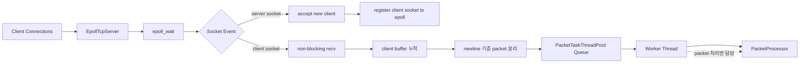

```mermaid
flowchart LR
    A[Client Connections] --> B[EpollTcpServer]
    B --> C[epoll_wait]
    C --> D{Socket Event}

    D -->|server socket| E[accept new client]
    E --> F[register client socket to epoll]

    D -->|client socket| G[non-blocking recv]
    G --> H[client buffer 누적]
    H --> I[newline 기준 packet 분리]
    I --> J[PacketTaskThreadPool Queue]
    J --> K[Worker Thread]
    K --> L[PacketProcessor]

    K -. packet 처리만 담당 .-> L
```