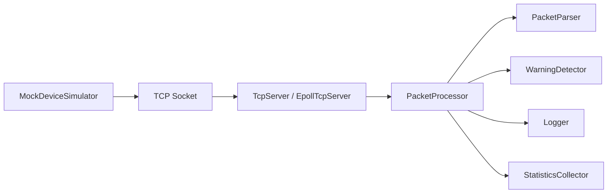

```mermaid
flowchart LR
    A[MockDeviceSimulator] --> B[TCP Socket]
    B --> C[TcpServer / EpollTcpServer]
    C --> D[PacketProcessor]
    D --> E[PacketParser]
    D --> F[WarningDetector]
    D --> G[Logger]
    D --> H[StatisticsCollector]
```