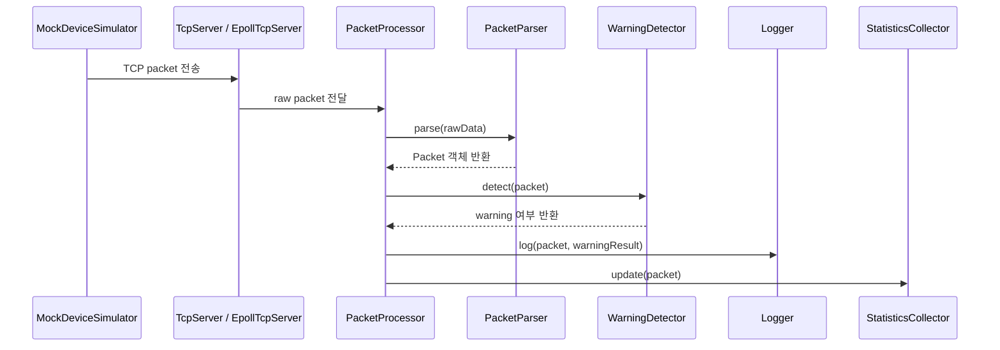

```mermaid
sequenceDiagram
    participant Mock as MockDeviceSimulator
    participant Server as TcpServer / EpollTcpServer
    participant Processor as PacketProcessor
    participant Parser as PacketParser
    participant Detector as WarningDetector
    participant Logger as Logger
    participant Stats as StatisticsCollector

    Mock->>Server: TCP packet 전송
    Server->>Processor: raw packet 전달
    Processor->>Parser: parse(rawData)
    Parser-->>Processor: Packet 객체 반환
    Processor->>Detector: detect(packet)
    Detector-->>Processor: warning 여부 반환
    Processor->>Logger: log(packet, warningResult)
    Processor->>Stats: update(packet)
```